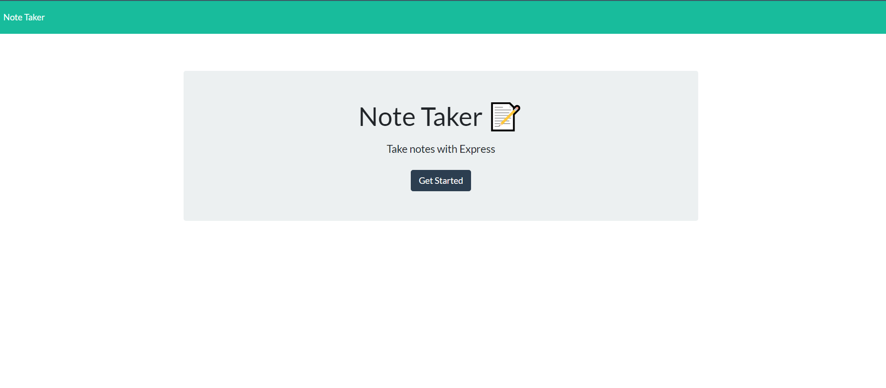
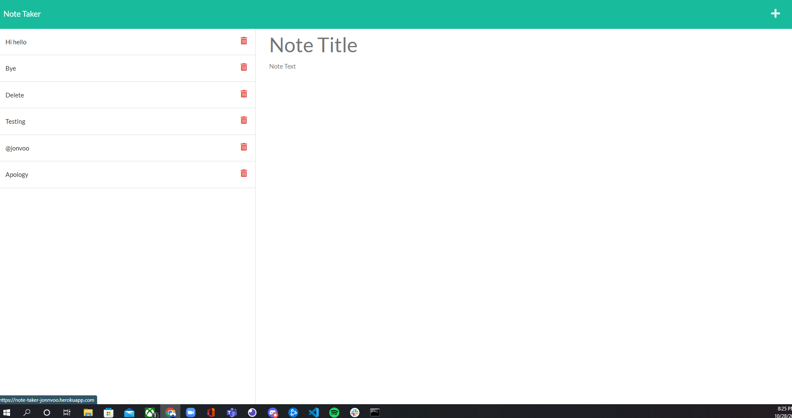
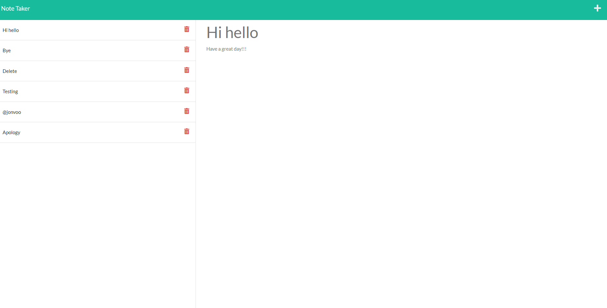

# Note_taker

## Description
This is an application that uses Express.js to run an back end server to the application. How it works is connecting routes to the front end so when users type in the URL on the server it will take them to the Note taker home page. Then when users click on the Get Started button it will then take them to the notes section. In the Notes section the user is able create notes which requires and title and a body of text. Once the requirements are met they are able to add the notes to the page. If there are multiple notes the user is able to click on each note to see the body of text in each note. In the top right corner users can click on the plus button to create another note. NOTE the dele functionality has not been added so you are not able to click the delete icon to delete the notes.

## User Story
AS A small business owner 
I WANT to be able to write and save notes 
SO THAT I can organize my thoughts and keep track of tasks I need to complete 

## Acceptance Criteria
GIVEN a note-taking application 
WHEN I open the Note Taker 
THEN I am presented with a landing page with a link to a notes page 
WHEN I click on the link to the notes page 
THEN I am presented with a page with existing notes listed in the left-hand column, plus empty fields to enter a new note title and the note’s text in the right-hand column 
WHEN I enter a new note title and the note’s text 
THEN a Save icon appears in the navigation at the top of the page 
WHEN I click on the Save icon 
THEN the new note I have entered is saved and appears in the left-hand column with the other existing notes 
WHEN I click on an existing note in the list in the left-hand column 
THEN that note appears in the right-hand column 
WHEN I click on the Write icon in the navigation at the top of the page 
THEN I am presented with empty fields to enter a new note title and the note’s text in the right-hand column 

## Installation 
* npm init -y 
* npm i
* npm install express
* npm install uniqid
* npm install nodemon

## Usage 
Installing the express will create the server packages where you are able to create GET and POST requests. The uniqid is a npm package that gives ID's to data you create. In this case, each note created will get a ID from the npm uniqid package. Nodemon will keep a local server running for you so every time you update your document it will reset the server and apply those changes. 
Once all these packages are installed the server should run smoothly. 

## ScreenShots 

Html Homepage 

Notes page 

Clicked on Note 

## Link
https://note-taker-jonnvoo.herokuapp.com/ 

## Questions 
Message me at these links for further questions.

https://github.com/Jonnvoo 
Jonathanvu2065@gmail.com